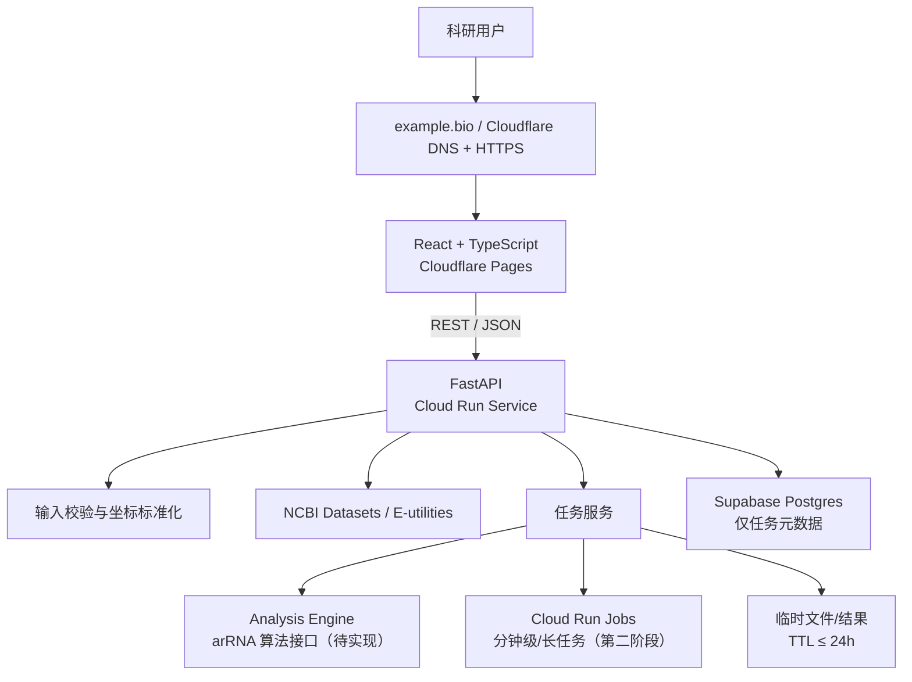
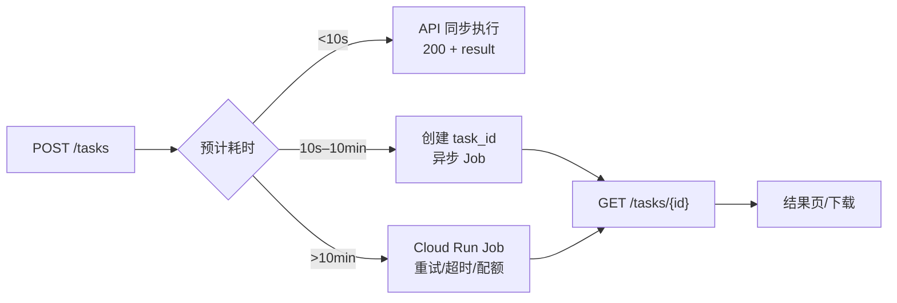

# LEAPER arRNA Designer：产品与技术架构

> 决策日期：2026-07-28。托管政策变化较快，上线前需再次核验价格与限制。

## 1. 决策摘要

采用“前后端分离的模块化单体”，而不是 Streamlit 单体或纯 Serverless
函数：



最终推荐：

```text
Frontend:   React + TypeScript + Vite + Tailwind CSS
Backend:    FastAPI + Pydantic + Biopython（按需）
Database:   Supabase Postgres（只存元数据与参考数据版本）
Deployment: Cloudflare Pages + Google Cloud Run
Domain:     注册商购买 → Cloudflare DNS → Pages / Cloud Run → 自动 HTTPS
```

选择模块化单体，是因为当前团队和功能规模不需要微服务；模块边界仍允许以后把
NCBI 同步、任务执行和结果导出独立成服务。

## 2. 三类架构比较

| 方案 | 开发速度 | UI/产品感 | 长任务 | 扩展性 | 结论 |
|---|---:|---:|---:|---:|---|
| A. React + FastAPI | 中 | 高 | 可演进为 Jobs/队列 | 高 | **推荐** |
| B. Streamlit | 最高 | 中低 | 与 Web 进程耦合 | 中低 | 仅适合内部原型 |
| C. 前端 + Serverless Function | 中 | 高 | 通常受超时/包大小限制 | 中 | 只适合轻量接口 |

Streamlit 可在 1–2 天内验证算法，但复杂的 transcript/exon 浏览、坐标联动、
任务历史和商业化品牌体验会快速触及组件与状态管理瓶颈。纯 Serverless Function
适合输入验证和很短的计算，不应承担生信长任务。

## 3. 前端技术比较

| 技术 | 优势 | 主要代价 | 适用判断 |
|---|---|---|---|
| React + Vite + Tailwind | 静态部署简单；生态适合 D3/Plotly/Mol*；平台无关 | SEO 需额外处理 | **MVP 推荐** |
| Next.js | SEO、路由、服务端渲染成熟 | 与 Vercel 绑定更深；本项目不需要 SSR | 营销内容大量增长时考虑 |
| Vue | 易学、工程质量好 | 团队/科学可视化生态选择略少 | 团队已有 Vue 经验可替换 |
| Streamlit | Python 一体化、最快 | 复杂交互、品牌和长期状态管理弱 | 内部原型 |

视觉语言：暖白背景、深炭灰正文、克制的 Nature 红作强调色；正文与数据使用
高可读无衬线字体，论文式标题可用衬线字体。图表颜色须兼容色觉缺陷，不能只靠
颜色表达 exon、CDS 或目标位点。

## 4. 前端托管比较

| 平台 | 免费方案概况（2026-07） | 域名/HTTPS | 中国大陆访问 | 判断 |
|---|---|---|---|---|
| Cloudflare Pages | 500 builds/月；单项目最多 100 个自定义域名；静态资源单文件 25 MiB | 支持，自动 TLS | 全球网络较好，但无大陆 SLA/ICP备案加速保证 | **推荐** |
| Vercel Hobby | 适合个人非商业项目；Function 时长和用途有限制 | 支持，自动 TLS | 可用性波动，不作保证 | Next.js 原型可用，商业化需升级 |
| Netlify Free | 300 credits/月，部署、流量和计算共同消耗 | 支持，自动 SSL | 可用性波动，不作保证 | 额度模型不如 Pages 直观 |

中国大陆访问不能由境外免费托管保证。MVP 可选择 Cloudflare 全球节点；若用户主要
在大陆且需要稳定低延迟，商业化阶段应迁移到中国大陆合规云、完成 ICP 备案，并使用
大陆 CDN。不要宣传“国内稳定访问”。

## 5. Python 托管比较

| 平台 | Python/容器 | 免费资源与限制 | 长任务/文件 | 结论 |
|---|---|---|---|---|
| Google Cloud Run | 原生容器 | 按请求计费并有月度免费额度；需绑定结算账号 | Service 请求最长 60 分钟；Jobs 单任务最长 7 天；临时磁盘 | **推荐** |
| Render Free | 原生 Python/Docker | 750 instance-hours/月；15 分钟空闲休眠；冷启动约 1 分钟 | 文件系统易失；免费服务可随时重启 | 备选演示环境 |
| Streamlit Community Cloud | Python/Streamlit | 资源动态；约 0.078–2 CPU、690MB–2.7GB RAM；默认上传 200MB | 运行文件不保证持久；UI 与计算耦合 | 内部原型 |
| Hugging Face Spaces | Gradio/Docker | 2026 年新计算型 Space 通常要求付费计划；免费硬件会休眠 | 临时磁盘；适合公开 Demo | 不作为免费生产后端 |
| Railway Free | 容器 | $1/月资源抵扣；约 0.5GB RAM、1 vCPU 上限 | 可挂小卷，但额度很快耗尽 | 试验可用，非持续生产 |
| Fly.io | 容器/VM | 新账户已无长期免费额度，旧账户保留 legacy allowance | 长任务可行但付费 | 不满足“免费” |

Cloud Run 的优势是同一个容器既可作为 HTTP API，也可在第二阶段作为 Job
运行，无需改写分析核心。免费额度不是“永久免费承诺”，必须设置预算告警、实例上限
和并发限制。

## 6. 任务执行策略



MVP 只承诺短任务；若算法初测超过 10 秒，立即启用 Cloud Run Jobs。不要使用
FastAPI `BackgroundTasks` 承担可靠任务，因为实例缩容或重启会丢任务。

是否需要基础设施：

- Redis：MVP 不需要。只有迁移到常驻 Celery worker 时才引入。
- Celery：MVP 不需要。Cloud Run Jobs 已提供任务隔离、超时和重试。
- SQLite：仅允许本地开发，不用于无状态容器生产环境。
- 云数据库：需要，用于任务状态、幂等键、数据版本和错误摘要。
- 对象存储：MVP 可不用；并发增加后使用带生命周期规则的私有对象存储。

## 7. 非功能要求

- 隐私：原始序列不长期保存；默认 TTL 24 小时；日志禁止记录序列正文。
- 可重现性：每个结果记录 pipeline、参数、参考组装、transcript accession/version。
- 安全：输入白名单、大小限制、内容嗅探、速率限制、CORS 白名单、无 shell 拼接。
- 可用性：NCBI 超时、指数退避、熔断式友好错误和缓存命中降级。
- 可观测性：结构化日志仅含 `request_id`、`task_id`、耗时、版本和错误码。
- 成本：Cloud Run `min-instances=0`、限制最大实例数、设置预算告警。

## 8. 主要风险

| 风险 | 影响 | 缓解 |
|---|---|---|
| NCBI 限流或结构变化 | Gene Mode 不可用 | API key、缓存、重试、契约测试、手工序列模式降级 |
| 坐标混用 | 科研结论错误 | 强类型坐标、显示 1-based、内部显式 coordinate_system |
| transcript 选择错误 | exon 编号和 reading frame 错误 | 默认 MANE Select/RefSeq Select，但强制显示 accession.version |
| 免费额度/政策变化 | 停机或收费 | 容器化、平台无关 API、预算告警、季度复核 |
| 临时实例重启 | 任务丢失 | 任务元数据持久化；分钟级任务用 Cloud Run Jobs |

## 9. 官方依据

- Cloudflare Pages limits: https://developers.cloudflare.com/pages/platform/limits/
- Cloudflare custom domains: https://developers.cloudflare.com/pages/configuration/custom-domains/
- Cloud Run pricing: https://cloud.google.com/run/pricing
- Cloud Run service timeout: https://docs.cloud.google.com/run/docs/configuring/request-timeout
- Cloud Run Jobs: https://cloud.google.com/run/docs/create-jobs
- Render Free: https://render.com/docs/free
- Streamlit limits: https://docs.streamlit.io/deploy/streamlit-community-cloud/manage-your-app
- Hugging Face Spaces: https://huggingface.co/docs/hub/spaces-overview
- Railway plans: https://docs.railway.com/pricing/plans
- Fly pricing: https://fly.io/docs/about/pricing/
- Netlify pricing: https://www.netlify.com/pricing/
